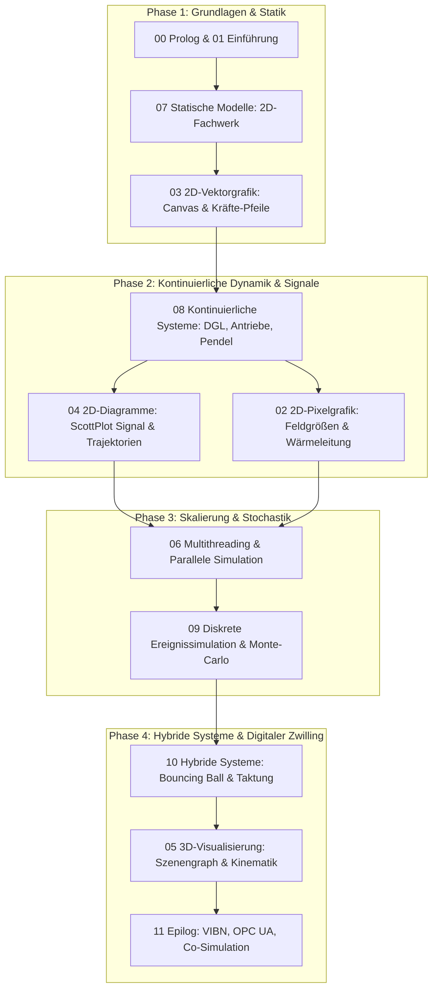

# Didaktische Analyse & Zielgruppen-Review: Vorlesung "Systemsimulation / Digitaler Zwilling"

**Studiengang:** Bachelor Automatisierungstechnik (5./6. Semester)  
**Institution:** FH Oberösterreich, Campus Wels  
**Dozent:** Dr. Georg Hackenberg  
**Gegenstand der Analyse:** Vollständiges Vorlesungsmaterial (`Folien/00_Prolog` bis `Folien/11_Epilog`)  
**Datum:** Oktober 2026  

---

## 1. Executive Summary & Gesamteindruck

Die Vorlesungsreihe **"Systemsimulation / Digitaler Zwilling"** zeichnet sich durch ein außergewöhnlich hohes fachliches und technisches Niveau aus. Die Unterlagen verbinden anspruchsvolle physikalisch-mathematische Modellierung mit solider Softwarearchitektur in C# (.NET 8) und moderner grafischer Aufbereitung im FH-OÖ-MARP-Design. 

Besonders hervorzuheben ist die didaktische Konzeption, nicht bloß "Black-Box"-Simulatoren (wie MATLAB/Simulink oder fertige Game-Engines) als Anwender zu bedienen, sondern die **mathematischen und softwaretechnischen Mechanismen unter der Haube** (Numerik, Integratoren, S-Function-Blockarchitektur, Szenengraph, Memory-Layout) von Grund auf transparent und implementierbar zu machen.

Gleichzeitig offenbart die systematische didaktische Analyse aus der Perspektive der Zielgruppe (**Bachelor Automatisierungstechnik im 5./6. Semester**) deutliche **strukturelle Spannungen, kognitive Überlastungszonen und Reibungspunkte im Curriculum**:

1. **Invertierter Lehrpfad (Tooling vor Domänenmodell):** Die ersten fünf Vorlesungswochen (Kapitel 02 bis 06) widmen sich fast ausschließlich Low-Level-Grafik und Nebenläufigkeit (Pixelpuffer, Zeigerarithmetik, Canvas-Transformationen, Fixed-Function OpenGL, Multithreading), bevor in Kapitel 07 das erste mechatronische Simulationsmodell gerechnet wird.
2. **Didaktische Inversion der Mathematik:** In Kapitel 02 wird als Visualisierungsbeispiel für Pixelgrafik eine 2D-Wärmeleitungssimulation mittels Partieller Differentialgleichungen (PDE) und finiter Differenzen (5-Punkt-Stern, CFL-Stabilitätsanalyse) eingeführt – weit vor Kapitel 08, in welchem überhaupt erst gewöhnliche Differentialgleichungen (ODE) und Euler-Integratoren erklärt werden.
3. **Gewaltiger Ausreißer im Umfang (Kapitel 05):** Mit 1.790 Zeilen und tiefgehenden Ableitungen von Normalenvektoren parametrischer Zylinder/Kugeln sowie einem 10-teiligen OOP-Szenengraph beansprucht die 3D-Computergrafik unverhältnismäßig viel Vorlesungszeit auf Kosten kerntechnischer Automatisierungsthemen.
4. **Diskrepanz zwischen Digitaler Zwilling und Vorlesungspraxis:** Der Digitale Zwilling wird in Kapitel 01 als Paradigma mit Datenrückkopplung und virtueller Inbetriebnahme motiviert, in den Kapiteln 02 bis 10 werden jedoch isolierte Offline-Simulatoren gebaut. Reale mechatronische Schnittstellen (OPC UA, Feldbus, TwinCAT/TIA, FMI/FMU) tauchen erst im Epilog (Kapitel 11) als theoretischer Ausblick auf.

---

## 2. Zielgruppenanalyse: Bachelor Automatisierungstechnik (5./6. Semester)

### 2.1 Vorkenntnisse und Kompetenzprofil
Studierende des 5. und 6. Semesters an der FH OÖ Campus Wels verfügen über spezifische Vorkenntnisse:
- **Mathematik & Naturwissenschaften (Stark):** Höhere Mathematik (Analysis, Lineare Algebra, Laplace-Transformation, Differentialgleichungen), Technische Mechanik (Statik, Kinetik, Dynamik), Grundlagen der Thermodynamik und Elektrotechnik.
- **Automatisierungs- & Regelungstechnik (Sehr stark):** Regelkreisstrukturen, PID-Regler, Zustandsraummodelle, Bode-/Nyquist-Diagramme, SPS-Programmierung nach IEC 61131-3 (ST, KOP, FUP), mechatronische Sensor-Aktor-Ketten, Signalverarbeitung.
- **Informatik & Programmierung (Heterogen bis moderat):** Grundlegende Programmierkenntnisse in C/C++ oder C#, funktionale und prozedurale Programmierung, einfache OOP-Konzepte. Typischerweise **keine** Vorkenntnisse in:
  - Low-Level C# Zeigerarithmetik (`unsafe`, `byte*`, `IntPtr`)
  - Fortgeschrittener UI-Framework-Interna (WPF Dependency Objects, CompositionTarget, Visual Trees, Render-Pipelines)
  - 3D-Computergrafik-Mathematik (Projektionsmatrizen, Phong-Shading, Gimbal Lock, Normalen-Tensoren)
  - Fortgeschrittener Softwarearchitektur (Entwurfsmuster wie Composite, Visitor, S-Functions).

### 2.2 Berufsfeld-Relevanz und Erwartungshaltung
Automatisierungsingenieure entwickeln und automatisieren Maschinen, Fertigungszellen und Prozessanlagen. Für ihre berufliche Praxis erwarten sie von einer Vorlesung "Systemsimulation / Digitaler Zwilling":
- Wie bilde ich das Verhalten einer Anlage (Antrieb, Mechanik, Sensorik, Prozess) in Echtzeit nach?
- Wie kopple ich mein Simulationsmodell mit einer Steuerung (SPS, Soft-SPS, IPC), um Steuerungssoftware vor dem Aufbau zu testen (Virtuelle Inbetriebnahme / VIBN)?
- Wie dimensioniere und parametriere ich Regler virtuell?
- Wie überwacht ein Digitaler Zwilling im Leitstand den Zustand einer Maschine (Condition Monitoring / Predictive Maintenance)?

---

## 3. Analyse von Progression & Rotem Faden

### 3.1 Die Makrostruktur: Phaseneinteilung

Die Vorlesung gliedert sich formal in drei große Blöcke:
1. **Prolog & Einführung (Kapitel 00–01):** Organisatorisches, Begriffsklärung, Taxonomie.
2. **Methodische Werkzeuge & Visualisierung (Kapitel 02–06):** 2D-Pixel, 2D-Vektor, Diagramme, 3D-OpenGL, Multithreading.
3. **Simulationsmodelle & Epilog (Kapitel 07–11):** Statisch, Kontinuierlich, Diskret, Hybrid, Synthese.

```
Aktuelle Abfolge:
[00 Prolog] ➔ [01 Einführung] 
 ➔ [02 Pixel (PDE/Wärme)] ➔ [03 Vektor] ➔ [04 ScottPlot/MSAGL] ➔ [05 OpenGL 3D] ➔ [06 Threads] 
 ➔ [07 Statik (LGS)] ➔ [08 Kontinuierlich (ODE)] ➔ [09 Diskret (DES)] ➔ [10 Hybrid (Zeno)] ➔ [11 Epilog]
```

### 3.2 Didaktische Reibungszonen in der Progression

#### A. Der "Tooling-First"-Schock (Wochen 2 bis 6)
Die Platzierung sämtlicher Visualisierungs- und Systemprogrammierthemen an den Vorlesungsbeginn erzeugt eine erhebliche didaktische Schieflage. Bevor die Studierenden eine einzige physikalische Systemgleichung in C# aufgestellt haben, müssen sie:
- in Kap. 02 Zeigerarithmetik (`uint*`), Little-Endian-Speicherordnung und Cache-Lokalität durchdringen;
- in Kap. 03 homogene Koordinatentransformationen, Bounding Boxes und DrawingVisuals codieren;
- in Kap. 04 Min/Max-Säulendecimation und Ringpuffer verstehen;
- in Kap. 05 ein 1.700 Zeilen starkes 3D-Grafikframework mit Szenengraphen nachbauen;
- in Kap. 06 Race Conditions, Sperrverfahren (`lock`) und TPL parallel programmieren.

Für Studierende der Automatisierungstechnik führt dies zu Motivationsverlust ("Habe ich mich in eine Informatik-Spezialvorlesung für Computergrafik verirrt?"). Die Frage: *"Wozu brauche ich das alles für die Systemsimulation?"* bleibt wochenlang unbeantwortet.

#### B. Paradoxe Didaktik bei den mathematischen Modellen
- **PDE vor ODE:** In Kapitel 02 wird zur Demonstration der `WriteableBitmap` die 2D-Wärmeleitungsgleichung (partielle Differentialgleichung) samt Ortsdiskretisierung via 5-Punkt-Stern und Von-Neumann-Stabilitätsanalyse ($s \le 0.25$) eingeführt. 
  Dies steht in krassem Kontrast zu Kapitel 08, wo Wochen später das explizite Euler-Verfahren für einfache gewöhnliche Differentialgleichungen (freier Fall: $\dot{v} = -g$) von Null an erklärt wird. Didaktisch muss das Einfache (skalare ODE 1. Ordnung) vor dem Komplexen (zweidimensionale parabolische PDE) gelehrt werden.
- **Entkopplung der Visualisierungen von den Modellkapiteln:**
  - Kapitel 03 (Vektorgrafik) führt Fachwerkkräfte und Pfeilspitzen als Mock-Beispiel ein. Das tatsächliche Fachwerkmodell folgt erst in Kapitel 07.
  - Kapitel 05 (3D-OpenGL) erarbeitet Kugel- und Zylinder-Normalen, wird aber in Kapitel 08 (Federpendel) oder Kapitel 10 (Bouncing Ball) in den Folien nicht als 3D-Simulation visualisiert (dort verbleibt die Darstellung rein diagrammatisch via ScottPlot). Der mühsam erarbeitete Szenengraph bleibt ein unvollendeter Vorratsspeicher.

---

## 4. Kognitive Belastung & Verständlichkeit (Kapitel-Review)

### Kapitel 00: Prolog
- **Stärken:** Übersichtliche Voraussetzungen, saubere Formalien, klare Vorstellung der Lernziele.
- **Kognitive Belastung / Reibung:** 
  - Die Wiederholung mathematischer Symbole ($\mathcal{P}(\cdot)$, $\forall$, $\exists$, $\Rightarrow$, $\Leftrightarrow$) und Rechnerarchitekturen (Von-Neumann vs. Harvard, Flynn-Taxonomie) wirkt wie ein abruptes Repetitorium aus dem 1. Semester.
  - **Empfehlung:** Statt trockener Mengenlehre lieber die Werkzeugkette (Visual Studio, Git, NuGet-Pakete, C# 12 Sprachfeatures) und ein konkretes Zielprojekt ("Am Ende des Semesters steuern wir einen simulierten mechatronischen Prüfstand") in den Fokus stellen.

### Kapitel 01: Einführung in Systemsimulation & Digitaler Zwilling
- **Stärken:** Exzellente, didaktisch geschliffene Motivation. Das Zitat von Box, die Abgrenzung statisch/dynamisch/diskret/kontinuierlich sowie die Definition des Digitalen Zwillings nach Grieves und der VIBN sind lehrbuchreif aufbereitet.
- **Verständlichkeit:** Sehr gut lesbar, anschauliche Illustrationen, hervorragende Folien-Dramaturgie.
- **Verbesserungspotenzial:** Die Verbindung zur Automatisierungstechnik (z.B. Erwähnung gängiger Werkzeuge wie MATLAB/Simulink, TwinCAT Kinematics, B&R IndustrialPhysics, Siemens Mechatronics Concept Designer) könnte noch prägnanter gezogen werden.

### Kapitel 02: 2D-Visualisierung (Pixel)
- **Stärken:** Fundierte Vermittlung nativer Speicherstrukturen (Stride, Row-Major, Little-Endian, Bgra32). Die Gegenüberstellung des schwerfälligen WPF Visual Tree mit dem speicherabgebildeten BackBuffer der `WriteableBitmap` ist technisch brillant.
- **Kognitive Überlastung:**
  - Der Sprung von der High-Level-Einführung (Kapitel 01) direkt zu `unsafe`, Zeigerarithmetik (`byte*`, `uint*`), Bit-Shifting (`(uint)a << 24 | ...`) und Cache-Miss-Vermeidung ist für Studierende ohne C++-Hintergrund extrem hart.
  - Die 2D-Wärmeleitungsgleichung überfordert an dieser Stelle: Die Studierenden müssen gleichzeitig Speicherzeiger bändigen und Laplace-Differenzenoperatoren verstehen.
- **Empfehlung:** In Kapitel 02 ein einfacheres, intuitiveres Bildbeispiel nutzen (z.B. ein statisches Graustufen-Sensormatrixfeld, ein 2D-Füllstandsraster oder Conway's Game of Life) und die physikalische Wärmeleitung als eigenständige Finite-Differenzen-Fallstudie nach Kapitel 08 verlegen.

### Kapitel 03: 2D-Visualisierung (Vektor)
- **Stärken:** Höchste Praxisrelevanz für Mechatroniker. Die mathematische Behandlung der Koordinatentransformation (kartesischer Weltraum mit $+Y$ nach oben $\to$ Bildschirmkoordinaten mit $+Y$ nach unten) unter strikter Wahrung des Seitenverhältnisses (`Uniform Scaling`) und Zentrierung ist vorbildlich gelöst.
- **Didaktische Highlights:** Die Herleitung der Pfeilspitze über Normalenvektoren ($\vec{u}^\perp = (-u_y, u_x)^T$) und der Performancevergleich zwischen `Shape`-Elementen und `DrawingVisual` / `DrawingContext`.
- **Verbesserungspotenzial:** Die Implementierung von Pan & Zoom via `MatrixTransform` ist elegant, erfordert aber fundiertes Verständnis von Matrizen im Hintergrund. Eine visualisierte Gegenüberstellung der Matrixmultiplikation würde das Verständnis noch vertiefen.

### Kapitel 04: 2D-Visualisierung (Diagramme & Graphen)
- **Stärken:** Das didaktisch am besten ausbalancierte Kapitel der Reihe. `ScottPlot` wird mit Fokus auf Performance (`Signal`-Plot mit $O(1)$-Indexberechnung und Min/Max-Säulen-Decimation) erklärt.
- **Highlights:** 
  - Die Thematisierung des Ringpuffers (`CircularBuffer`) zur Vermeidung von GC-Allokationen bei 1-kHz-Telemetriedaten ist essenziell für reale Digital-Twin-Dashboards.
  - Die automatische Graphenvisualisierung mit MSAGL und die farbliche Detektion algebraischer Schleifen schlägt eine hervorragende Brücke zur Systemtheorie.

### Kapitel 05: 3D-Visualisierung mit OpenGL
- **Stärken:** Enorme Detailtiefe, sauberer Aufbau von der Fixed-Function-Pipeline über Phong-Beleuchtung bis zum hierarchischen Szenengraphen und einer kardanfehlerfreien OrbitCamera.
- **Kritische Mängel & Kognitive Belastung:**
  - **Umfangsexplosion:** Mit 1.790 Zeilen und 100+ Folien sprengt das Kapitel jeden vernünftigen zeitlichen Rahmen einer 2- oder 3-SWS-Vorlesung.
  - **Veraltetes Paradigma:** Fixed-Function OpenGL (`glBegin`, `glEnd`, `glMatrixMode`) entspricht dem Stand von OpenGL 1.1 (1995). Moderne Bibliotheken in der Industrie nutzen Shader-Pipelines oder High-Level-Engines (wie Helix Toolkit in WPF oder OpenTK/Silk.NET).
  - **Mathematische Überfrachtung:** Die seitenlange analytische Herleitung von Oberflächennormalen für Kugel und Zylinder bindet Zeit, die den Studierenden später bei der numerischen Lösung steifer Systeme oder bei der Sensorfusion fehlt.
- **Empfehlung:** Straffung um 60%. Konzentration auf das Konzept des Szenengraphen (Translation, Rotation, Kapselung von 3D-Baugruppen wie z.B. Roboterachsen) und Verzicht auf manuelle Normalenableitungen.

### Kapitel 06: Multithreading & Parallele Simulation
- **Stärken:** Äußerst praxisnah und für C# exzellent strukturiert. Der Bogen von `Parallel.For` über Race Conditions (`lock`, `ConcurrentBag`) bis zur Entkopplung von rechenintensiver Simulation und UI-Rendering mittels `async`/`await`, `Task.Run` und `Progress<T>` ist didaktisch gelungen.
- **Didaktische Einbettung:** Multithreading steht derzeit etwas "isoliert" zwischen 3D-Grafik und Statik. Es sollte klar als methodisches Fundament für die späteren Monte-Carlo-Verfahren (Kap. 09) deklariert werden.

### Kapitel 07: Statische Modelle (Fachwerke 2D/3D)
- **Stärken:** Klassisches mechatronisches Thema, schlüssige Herleitung vom Kräftediagramm über das lineare Gleichungssystem ($A \cdot x = b$) bis zur Finite-Elemente-artigen Steifigkeitsmatrix des elastischen Fachwerks.
- **Verständlichkeit & Lücken:**
  - Der Übergang vom idealen Fachwerk (starr, nur Gelenkkräfte) zum elastischen Fachwerk (Verschiebungen $\Delta u$, Stabsteifigkeitsmatrix $K_e = \frac{EA}{L}$) ist mathematisch anspruchsvoll. Hier fehlen anschauliche Zwischenschritte: Warum lautet die Transformationsmatrix $T$, und wie wird die globale Steifigkeitsmatrix $K_{global}$ assembliert?
  - Die C#-Objektstruktur (`Node`, `Rod`, `Truss`) ist gut, aber die Anbindung an `Math.NET Numerics` zur LGS-Lösung wird zu knapp abgehandelt.

### Kapitel 08: Kontinuierliche Dynamische Modelle
- **Stärken:** **Das Herzstück der Systemsimulation.** Die Nachbildung einer blockbasierten Simulationsumgebung (im Stile von Simulink S-Functions mit `Block`, `Connection`, `IntegrateBlock`, `AddBlock`, `GainBlock`) in C# ist didaktisch meisterhaft.
- **Didaktische Reibungspunkte:**
  - Der Einstieg mit dem freien Fall wirkt nach den anspruchsvollen Kapiteln 02–07 fast trivial, wohingegen die anschließende Implementierung der algebraischen Schleifenerkennung und des impliziten Euler-Solvers mit multidimensionalem Newton-Raphson-Verfahren Studierende völlig unvorbereitet trifft.
  - Der Begriff der "algebraischen Schleife" wird mehrfach wiederholt, aber der Lösungsalgorithmus im Code (`EulerExplicitLoopSolver`) ist sehr abstrakt gehalten.

### Kapitel 09: Diskrete Dynamische Modelle
- **Stärken:** Großartige Ergänzung zur kontinuierlichen Physik. Die Formalisierung der diskreten Ereignissimulation (DES, Next-Event-Time-Advance, PriorityQueue, Event-Handler) anhand einer Warteschlange ist klar und sauber.
- **Didaktische Höhepunkte:**
  - Die Verbindung zur Stochastik: Zufallsgenerierung mittels Inversionsmethode und Box-Muller-Transformation.
  - Parallele Monte-Carlo-Läufe mit Konfidenzintervall-Auswertung schließen den Kreis zu Kapitel 06 (Multithreading) und Kapitel 04 (ScottPlot Histogramme).

### Kapitel 10: Hybride Dynamische Modelle
- **Stärken:** Behandelt die anspruchsvollste Klasse dynamischer Systeme. Der Übergang vom kontinuierlichen Flug zur diskreten Stoßphase (Bouncing Ball) und die Modellierung digital getakteter Sensoren mit variabler Abtastrate sind didaktisch mustergültig.
- **Kognitive Hürde:** Die Implementierung der Nulldurchgangsdetektion (Zero-Crossing) im Solver erfordert exakte zeitliche Rückschritte (Bisektion / Zeitschrittverkürzung). Hier neigen Studierende dazu, die Übersicht über die Solver-Zustände (`Mode Switch`) zu verlieren.

### Kapitel 11: Epilog & Synthese
- **Stärken:** Exzellente Zusammenfassung des Semesters. Die Modellierungsmatrix, die Richtlinien zur Solver-Wahl (Stiffness, Schrittweitenkontrolle) und der Ausblick auf FMI/FMU, VIBN und HiL sind Gold wert für angehende Automatisierungsingenieure.
- **Kritik:** Der hohe Wert dieses Kapitels verdeutlicht, was in den Kapiteln davor zu kurz kam: die Einbindung in reale Steuerungsumgebungen.

---

## 5. Reibungspunkte & Mängel bezüglich des Praxisbezugs zur Automatisierungstechnik

| Bereich | Aktueller Zustand in den Folien | Typische AT-Realität (Campus Wels) | Didaktische Konsequenz |
| :--- | :--- | :--- | :--- |
| **System-Domänen** | Starker Fokus auf Statik (Fachwerk) und Mechanik (freier Fall, Pendel, Ball). | Mechatronik: Antriebe (Servomotor, BLDC), Thermische Systeme, Pneumatik/Hydraulik, Regelkreise. | Studierende identifizieren sich zu wenig mit den Beispielen; die Übertragbarkeit auf mechatronische Antriebssysteme fehlt. |
| **Steuerungskopplung** | Rein theoretische Erwähnung im Epilog ("VIBN", "HiL"). Keine Live-Anbindung im Code. | SPS (B&R Automation Studio, Siemens TIA Portal, Beckhoff TwinCAT), Feldbusse, OPC UA. | Der Kurs bleibt "Informatik-Simulation" und wird nicht als "Digitaler Zwilling" mit aktiver Steuerungskopplung erlebt. |
| **Regelungstechnik** | Simulation meist ungesteuert / open-loop (z.B. ungedämpftes Pendel, freier Wurf). | Geschlossene Regelkreise (Closed-Loop): Strecke + PID-Regler + Aktor-Sättigung + Sensorrauschen. | Automatisierer simulieren fast nie offene Systeme; sie wollen Regler auslegen und das Führungs- und Störverhalten testen! |
| **Standard-Schnittstellen** | Eigene blockbasierte Architektur (S-Functions) in C#. | FMI / FMU (Functional Mock-up Interface) als Industriestandard. | Enormer Lerneffekt für Architektur, aber fehlende Vertrautheit mit FMI-Standards in der Projektpraxis. |

---

## 6. Didaktische Empfehlungen & Konkrete Verbesserungspotenziale

### 6.1 Vorschlag zur Reorganisation der Vorlesungsstruktur (Der "Just-in-Time"-Ansatz)

Statt die Vorlesung strikt in *alle Visualisierungen zuerst* und *alle Modelle danach* zu teilen, wird eine **integrative, spiralförmige Progression** empfohlen. Werkzeuge werden exakt dann eingeführt, wenn das physikalische Modell nach ihnen verlangt:



#### Didaktischer Gewinn dieser Struktur:
1. **Sofortiger Physikbezug:** Bereits in Woche 2 berechnen die Studierenden ein Fachwerk und visualisieren es in Woche 3 als Vektorgrafik im Canvas.
2. **Mathematische Logik:** ODEs (Kapitel 08) werden vor PDEs (Wärmeleitung) gelehrt.
3. **Motivation durch Feedback:** Nach jeder mathematischen Modellierung folgt direkt die passende grafische Belohnung.

---

### 6.2 Spezifische Maßnahmen für einzelne Kapitel

#### 1. Entlastung von Kapitel 05 (3D-OpenGL)
- **Kürzung um ca. 50%:** Streichung der detaillierten trigonometrischen Herleitungen von Normalenvektoren für Kugel und Zylinder. Übergabe von fertigen Mesh-Generatoren.
- **Fokus auf mechatronische Kinematik:** Nutzung des Szenengraphen zur Abbildung einer seriellen Kinematik (z.B. SCARA-Roboter mit Dreh- und Schubgelenken). Studierende verstehen Matrizenhierarchien am besten anhand rotierender Roboterachsen!

#### 2. Praxisbeispiele aus der Automatisierungstechnik integrieren
- **In Kapitel 08 (Kontinuierlich):** Ergänzung des Federpendels um einen **geregelten Gleichstrom-Servomotor** (PT1-System mit Gegen-EMK, Drehmomentkonstante und PID-Positionsregler). Das schlägt die perfekte Brücke zur Vorlesung Regelungstechnik.
- **In Kapitel 09 (Diskret):** Modellierung einer **Materialfluss-Taktstraße** mit Stau-Rollenförderern und Lichtschranken anstelle einer abstrakten Bankschalter-Warteschlange.
- **In Kapitel 10 (Hybrid):** Modellierung eines **Pneumatikzylinders mit Endlagendämpfung und Sensor-Endschaltern**.

#### 3. Brücke zum Digitalen Zwilling schlagen (Hands-on VIBN)
- Im begleitenden Labor/Projekt sollte eine einfache Schnittstelle bereitgestellt werden (z.B. ein lokaler C#-basierter OPC-UA-Server oder eine TCP/IP-Schnittstelle), über die eine Soft-SPS (z.B. TwinCAT oder Codesys) Sollwerte an die C#-Simulation schickt und Sensor-Rückmeldungen empfängt.
- Damit wird der Begriff des "Digitalen Zwillings" für die Studierenden vom Modewort zum realen, anfassbaren Softwarekonzept.

---

## 7. Zusammenfassendes Fazit

| Dimension | Bewertung (1-5 Sterne) | Kommentar |
| :--- | :---: | :--- |
| **Fachliche Tiefe & Korrektheit** | ⭐⭐⭐⭐⭐ | Höchstes akademisches Niveau; Algorithmen und mathematische Modelle sind absolut präzise formuliert. |
| **Code-Qualität & Architektur** | ⭐⭐⭐⭐⭐ | Mustergültige C#-Architektur (.NET 8, TPL, MVVM, S-Functions, entkoppelte Solver). |
| **Didaktische Progression (Roter Faden)** | ⭐⭐⭐☆☆ | Durch die Blocktrennung "Erst alle Visualisierungen, dann alle Modelle" unnötig zerrissen; mathematische Inversion (PDE vor ODE). |
| **Kognitive Angemessenheit** | ⭐⭐⭐☆☆ | Einstieg in Kapitel 02 (`unsafe`) und Umfang von Kapitel 05 (OpenGL) überfordern Bachelor-Studierende; kognitive Überlastung zu Semesterbeginn. |
| **Zielgruppenpassung (AT Wels)** | ⭐⭐⭐⭐☆ | Hohe Relevanz bei Solvern und Mechanik; Lücken bei Regelungstechnik, Antriebstechnik und praktischer SPS-Kopplung. |

**Schlussfolgerung:**  
Das Vorlesungsmaterial ist ein didaktischer und fachlicher Schatz. Durch eine gezielte Entflechtung des "Grafik-Blocks", die Straffung von Kapitel 05, den sanfteren Einstieg in Low-Level-Themen und die stärkere Anreicherung mit mechatronisch-regelungstechnischen Beispielen wird das Skriptum zu einem der besten und modernsten Ausbildungswerke für Digitale Zwillinge im deutschsprachigen Raum.
